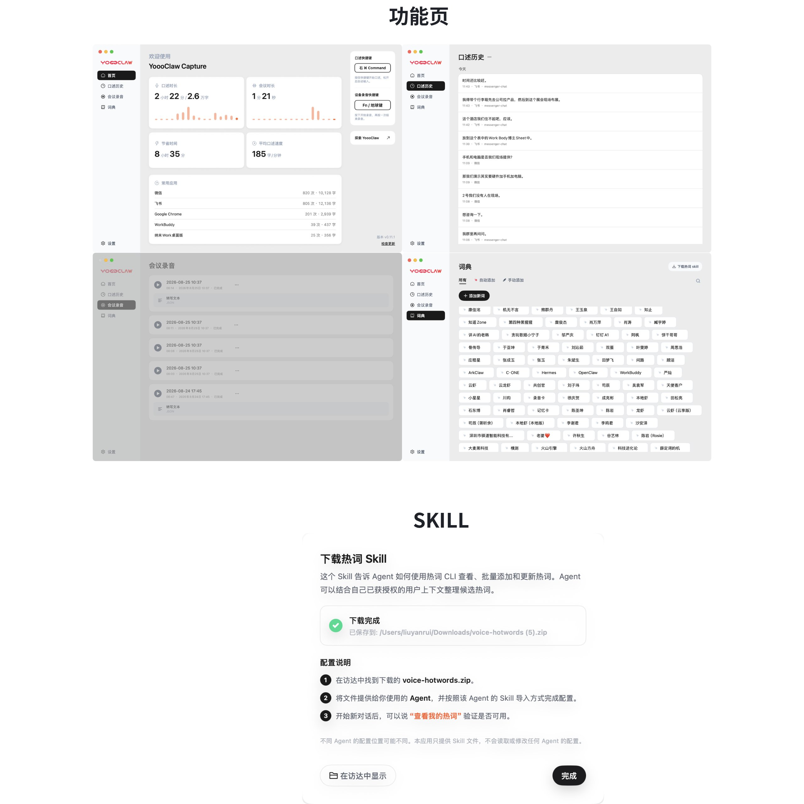
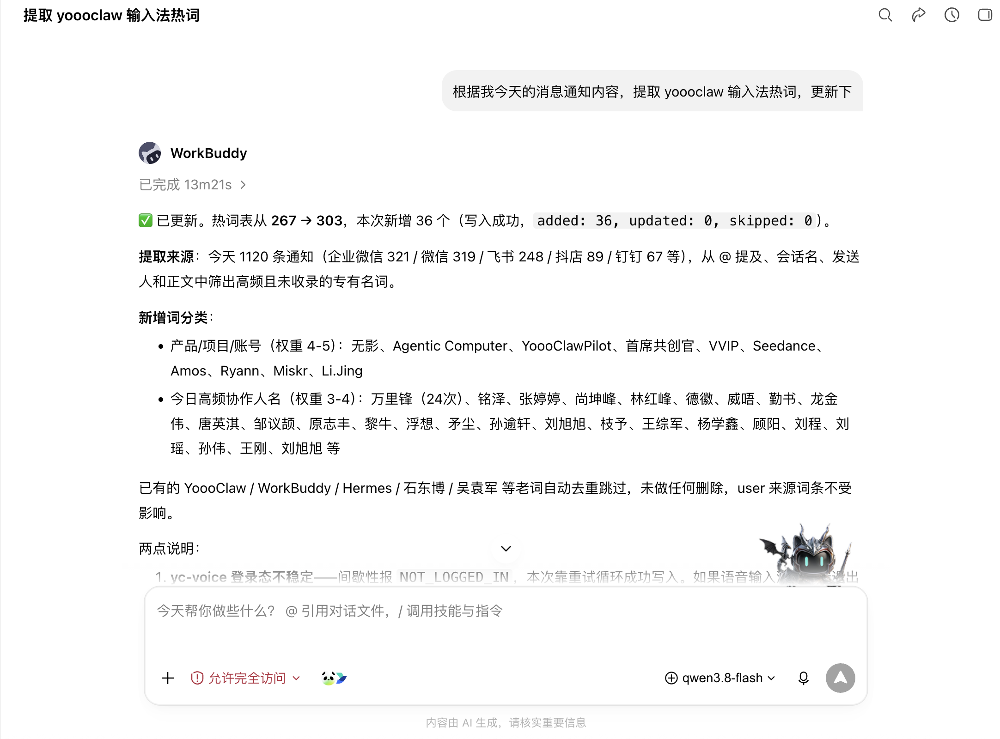
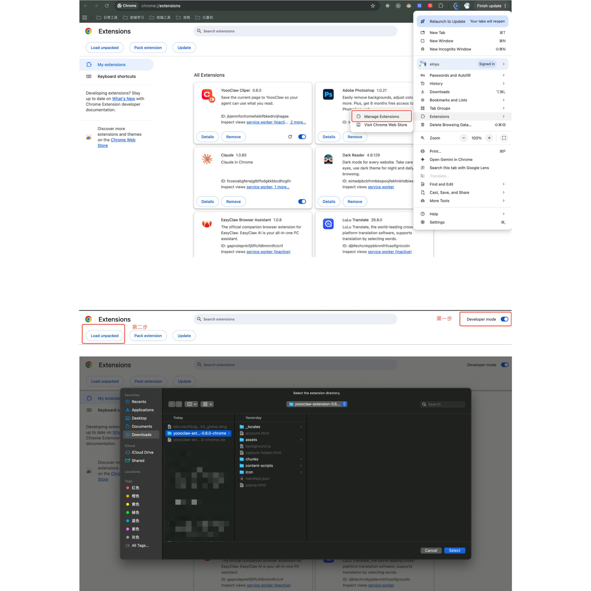
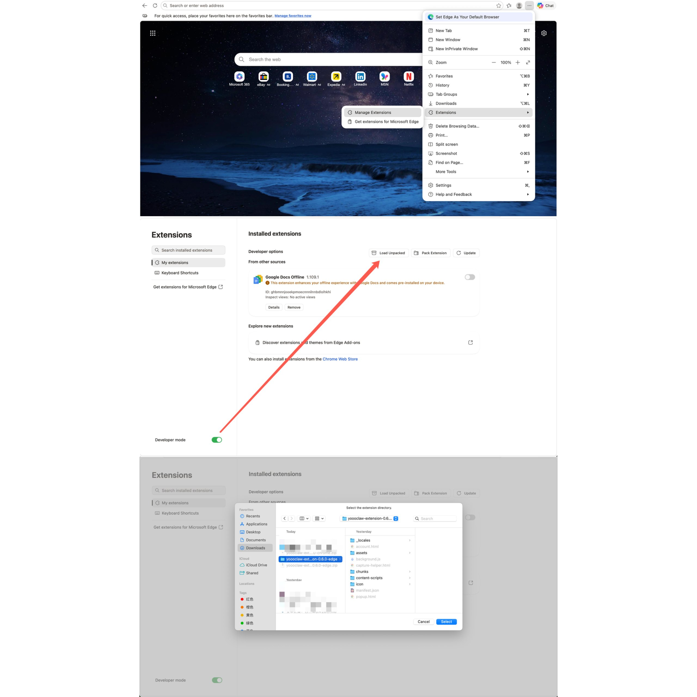
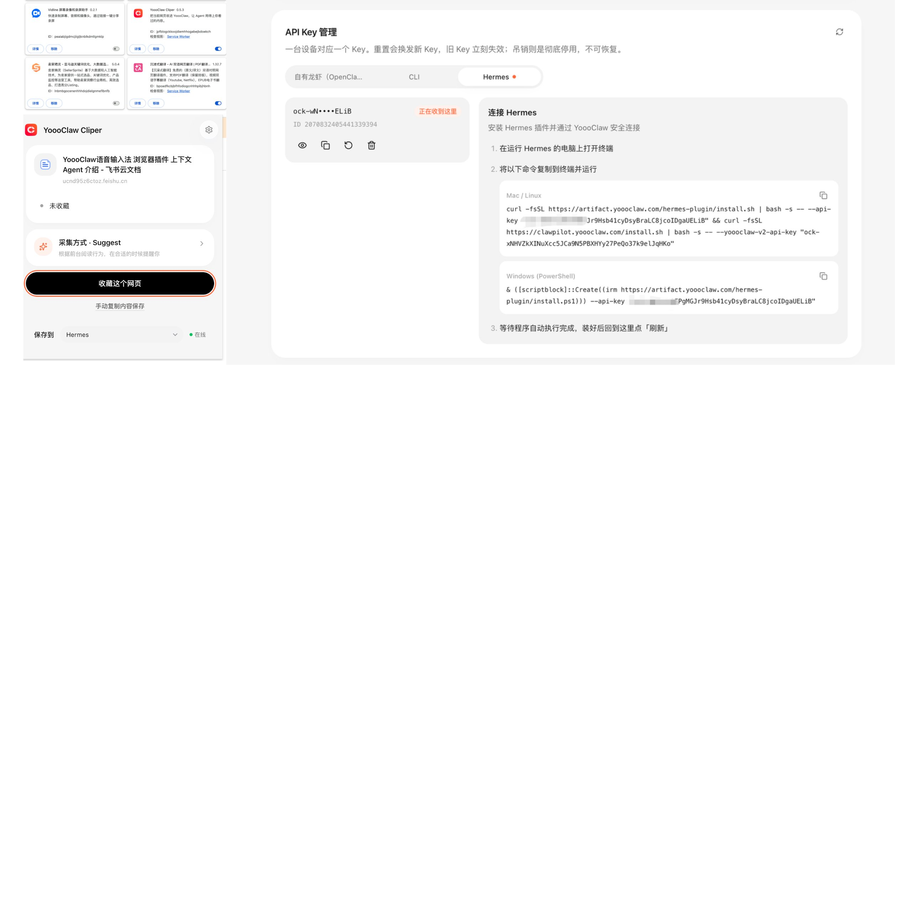
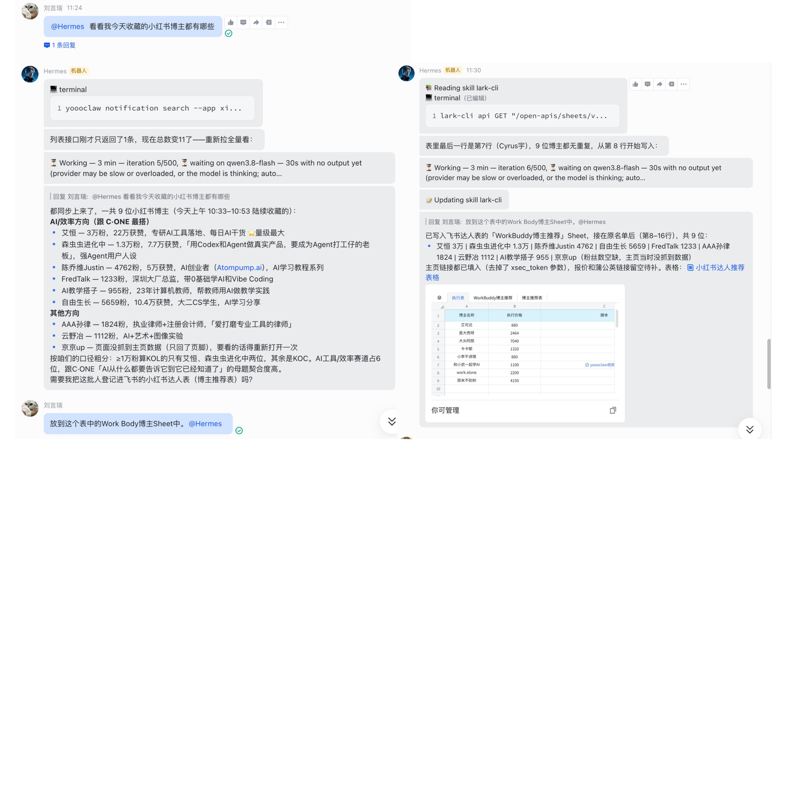
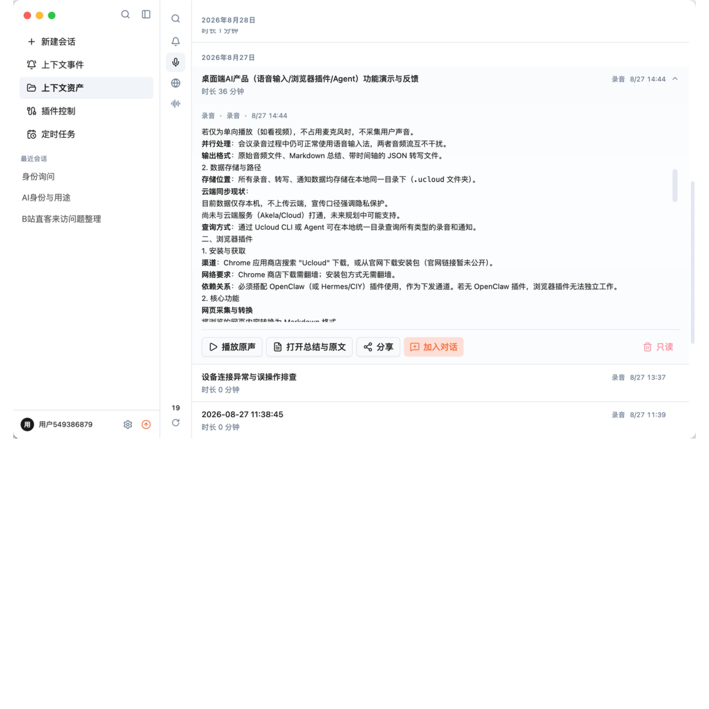

## YoooClaw Capture（桌面语音输入法）

#### **功能说明：**

1. 语音输入，**C·ONE 产品是可以获取到你收到的消息，这个输入法可以保存你发出去的消息**
2. 电脑会议录音转写
3. 热词 skill，**所有 agent 可以配置输入法热词，配合 C·ONE的消息采集会议录音等提取热词，更懂你的输入法**

#### Mac 体验地址

- [https://yoooclaw-artifacts.oss-cn-hangzhou.aliyuncs.com/voice-input-method/0.11.0/1/yoooclaw-voice-input.dmg](https://yoooclaw-artifacts.oss-cn-hangzhou.aliyuncs.com/voice-input-method/0.11.0/1/yoooclaw-voice-input.dmg)

#### Windows 体验地址

- [https://yoooclaw-artifacts.oss-cn-hangzhou.aliyuncs.com/voice-input-method-windows/0.11.3/YoooClaw-Setup-0.11.3.exe](https://yoooclaw-artifacts.oss-cn-hangzhou.aliyuncs.com/voice-input-method-windows/0.11.3/YoooClaw-Setup-0.11.3.exe)

Workbuddy 调用 YoooClaw输入法的热词Skill,从c one获取的消息通知中提取高频使用的词汇进行更新。

## YoooClaw Cliper（浏览器插件 ）

#### **功能说明：**

1. 网页采集转 Markdown

   - 核心功能：把你浏览的网页采集转换为 Markdown 文件，存入本地（`.ucloud` 或 OpenClaw/龙虾目录下的收藏文件夹）
   - 同时保存网页本身，但样式会被洗掉，只保留纯文本内容
   - 明确说明"这个 Markdown 本质上不是给人看的，是给 AI（Agent）看的"
2. 智能收藏提示

   - 插件会观察你的阅读行为，判断你可能需要收藏时，大约 10–15 秒后自动弹出收藏提示
   - 如果没自动弹出，也可以手动点击收藏按钮
3. 与本地 Agent 打通

   - 收藏的内容存在与通知、录音同级的目录结构下，Agent（龙虾/OpenClaw、Work Buddy 等）通过 Skill 扫描该目录即可检索
   - 可以直接问 Agent"我刚刚收藏了什么网页，帮我看一下"
   - 相关 Skill 已内置在最新版的配套插件里，更新到最新版即可使用

#### Chrome 体验指南

1. 插件下载地址：

   - [https://artifact.yoooclaw.com/extension/download/yoooclaw-extension-chrome.zip](https://artifact.yoooclaw.com/extension/download/yoooclaw-extension-chrome.zip)
2. 安装教程

   

#### Edge插体验指南

1. 插件下载地址：

   - [https://artifact.yoooclaw.com/extension/download/yoooclaw-extension-edge.zip](https://artifact.yoooclaw.com/extension/download/yoooclaw-extension-edge.zip)
2. 插件安装指南：

安装到 chrome 插件中，用 YoooClaw APP同账号登录，支持 Hermes 插件/OpenClaw 插件/CLI电脑全局接入

使用案例：收藏 ai 博主，自动填入飞书表格

## ClawPilot Desktop（桌面上下文 Agent）

#### **功能说明：**

1. 上下文扫描与问答

   - 自动扫描本机所有上下文资产（**通知、网页、录音、语音输入内容**）
   - 基于商业模型能力回答问题，引用来源透明
2. 任务执行

   - 与常规 Agent 一样能干活：生成 PPT、生成 Markdown 文档等
   - 支持对话中动态加入特定上下文，比如"帮我看看刚才收藏的网页"
3. 插件管理看板

   - 可视化管理配套插件的安装状态、执行重新安装
   - 统计本机网页数据、通知数据的条数
4. 定时任务

   - 类似龙虾（OpenClaw）的定时任务（cron job）
5. Business Events（事件监听与触发）

   - 监听事件：收到通知、有新录音下发到本地、收藏了网页、发了一条语音
   - 触发预设动作：例如"新收藏的网页自动生成总结"、"收到某人发来的通知时自动做某事"

#### Mac 体验地址：

- https://artifact.yoooclaw.com/clawpilot-desktop/v0.18.2/clawpilot-desktop-mac-arm64.dmg

